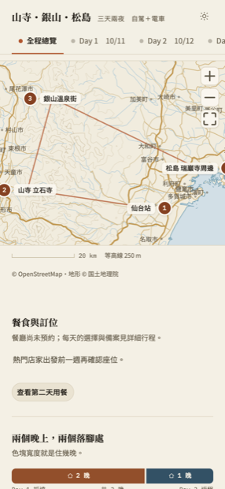
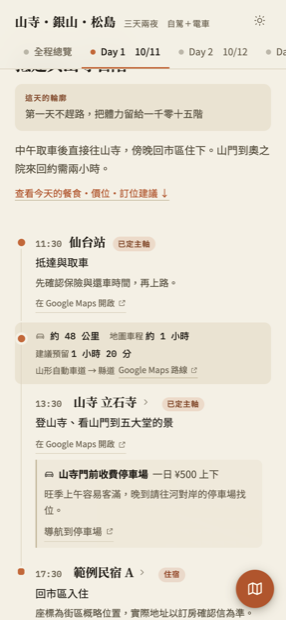
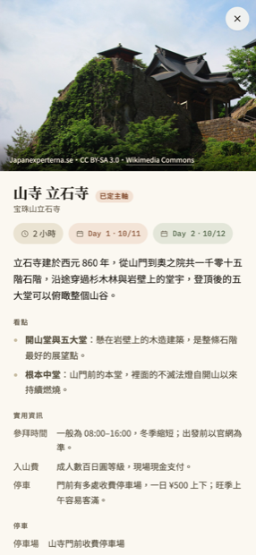
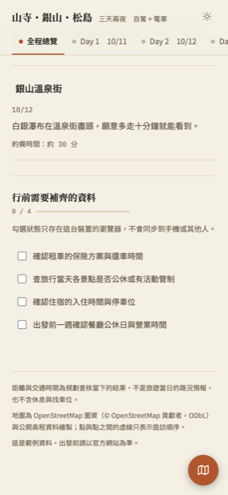

# travel-planner

把一份粗略的旅程初稿，變成一個能在手機上用的互動行程網頁——有地形圖、逐段交通、餐食與備案、行前清單——然後放到你自己的免費 Cloudflare 帳號上。

**你不需要懂程式。** 複製下面那段話貼給你的 AI 助手，剩下它會處理。

**先看看做出來會長什麼樣** → **[示範站：山寺・銀山・松島（三天兩夜）](https://example-trip.wangch2215.workers.dev)**

用手機開最準——這個東西就是做給人在旅途中用手機看的。

| 全程總覽 | 逐段交通 | 地點燈箱 | 行前清單 |
|---|---|---|---|
|  |  |  |  |
| 地形底圖、每個停留點、住幾晚 | 距離、車程、**建議預留**、停車場 | 照片與授權、看點、實用資訊 | 待確認事項，勾選只存在你的裝置 |

（示範站是一份去識別化的範例資料，住宿是虛構名稱。）

---

## 開始：複製這段貼給你的 AI

點程式碼框右上角的複製按鈕，整段貼給你的 AI 助手：

```text
我想做一個旅程網頁。請用這個公開模板：
https://github.com/wangch15/travel-planner

我的環境已經準備好了（Node、git、gh 都裝好，GitHub 也登入了）。
我不懂程式，所以接下來也請你全部幫我處理。

請照 tp-setup 這個 skill 的步驟做，從頭開始。
取得專案那一步：clone 這個公開模板，然後幫我開一個**私有** repo 當 origin。
模板是公開的沒關係，但我的行程資料要放在我自己的私有 repo 裡。
不要用 fork——公開 repo 的 fork 一定是公開的，改不了。
拿到專案之後先讀裡面的 AGENTS.md。

需要我本人操作的步驟（在瀏覽器上按同意授權、註冊 Cloudflare 帳號），
請停下來用白話告訴我該點哪裡，等我做完再繼續。

如果你抓不下來、看不到內容、或任何一步卡住了，
直接告訴我卡在哪裡、要我做什麼，不要自己猜或跳過。
```

**就這樣。** 接下來 AI 會問你行程的事（想去哪、幾天、幾個人、有沒有訂房），你用講的回答就好。

> **還沒準備好環境？**（沒裝過 Node、git，或還沒辦 GitHub 帳號）
> 回頭跟給你這個連結的人要「前置準備」那段，那裡有一段 prompt 會帶你把環境一次弄好。
>
> **Cloudflare 帳號現在不用辦。** 那是最後要讓網站有固定網址時才需要的，
> 在那之前 AI 給你的預覽網址手機就打得開。到時候它會提醒你。

---

## 接下來會發生什麼

AI 會照這個順序帶你走，每一步都會跟你確認：

| 階段 | 它做什麼 | 你做什麼 |
|---|---|---|
| **準備環境** | 裝工具、下載專案、接上你的 GitHub | 註冊帳號、在瀏覽器按授權 |
| **聊行程** | 問你想去哪、住哪、怎麼移動，整理成逐日草案 | 用講的回答；**看過草案點頭** |
| **查資料** | 查景點、路線、停車、餐廳，每一筆都附來源 | 等（這一步最久） |
| **做地圖與照片** | 產生地形底圖、抓授權合法的照片 | 等 |
| **上線前確認** | 給你一個網址，**用手機就打得開** | **打開看過、確認沒問題** |
| **上線** | 部署到你的 Cloudflare 帳號，給你網址 | 註冊 Cloudflare、按授權 |

**有三件事 AI 一定會停下來等你**，不會自己決定：

1. 行程草案要你點頭才會開始查資料
2. 網站要你看過才會上線
3. **任何要花錢或代表你的事**——訂房、訂位、註冊帳號——它只會給你連結，不會替你做

---

## 卡住了怎麼辦

直接把狀況貼給你的 AI 就好。下面是幾個常見的，以及可以怎麼跟它說：

**「AI 說它開不了我的 repo／沒有權限」**

> 請先跑 `gh auth login` 讓我在瀏覽器上授權，然後再試一次。模板本身是公開的，不用登入就抓得到；要登入的是「幫我開一個私有 repo」那一步。

**「AI 把專案 fork 走了，或說我的 repo 是公開的」**

> 請停下來。我的行程資料不能放在公開的 repo。請照 `.ai/rules/repo-ownership.md` 的做法，幫我改成「clone 公開模板 + 我自己的私有 repo」。

**「AI 說我電腦上沒有 git」**

> 請幫我裝 git，告訴我要按什麼。裝完再繼續。

**「AI 說它不能執行指令／沒有終端機權限」**

那個工具不適合做這件事。要用**可以在你電腦上執行指令**的 AI，例如 Claude Code、Codex CLI、Gemini CLI。

**「AI 開始自己亂改東西，或跳過問我」**

> 請停下來。照 AGENTS.md 裡寫的流程走，該問我的地方要問我。

---

## 常見問題

**這個網站別人看得到嗎？**

網站不會被搜尋引擎收錄，但**拿到網址的人就能打開**，不是密碼保護。所以不要把訂單號、門鎖密碼、電話寫進去——AI 也被規定不准把這些放進網頁，那些只會留在你自己電腦上的筆記裡。

**要花錢嗎？**

不用。GitHub 與 Cloudflare 的免費方案就夠。

**做好之後想改東西呢？**

跟你的 AI 說就好，例如「第三天的午餐換一家」「加一個景點」。它知道要改哪裡。

小修改（換一家店、改個時間、改幾行字）它自己驗過就直接更新網站，然後告訴你改了什麼、網址是什麼；
動到天數、地點、地圖或日期這種比較大的改動，它會先給你一個網址、請你看過再更新。

**模板有更新的話？**

跟 AI 說「模板有更新，幫我更新一下」。它會把新功能合併進來，你的行程資料不會被動到。

---

<details>
<summary><b>技術細節</b>（給想自己動手的人，不看也不影響使用）</summary>

## 需要什麼

- **Node.js 20+**、git、[gh](https://cli.github.com/)
- GitHub 帳號、Cloudflare 免費帳號

## 快速開始

```bash
npm install
npm test                      # 引擎自我檢查，應該全綠
npm run check -- _example     # 驗證附帶的範例行程
npm run preview -- _example   # 開 http://localhost:4173 看實際頁面
```

`trips/_example/` 是一份去識別化的三天兩夜範例：住宿是虛構名稱，沒有航班與聯絡資訊，但資料的形狀跟真實行程一模一樣。**要知道一份行程資料該長什麼樣，先看它。**

## 指令

所有指令都吃一個 `<slug>` 參數（行程資料夾名稱）。`trips/` 底下只有一個行程時可以省略；有多個而沒指定時會報錯並列出可選的。

| 指令 | 做什麼 |
|---|---|
| `npm run trips` | 列出所有行程、資料是否通過驗證、各自的部署網址（`--all` 連內建範例一起列） |
| `npm run new -- <slug>` | 建立一個新行程的骨架 |
| `npm run new -- <slug> --from <舊slug>` | 同上，但沿用舊行程的偏好設定與 `theme.css`（日期、bbox、標題、`deploy.name` 不沿用） |
| `npm run check -- <slug>` | 驗證資料：座標、交通方式、詳細說明、照片授權、清單一致性 |
| `npm run build -- <slug>` | 產出 `dist/<slug>/site/index.html`（單一檔案）與 `wrangler.json` |
| `npm run preview -- <slug>` | build 後在 `localhost:4173` 開一個本機伺服器 |
| `npm run preview -- <slug> --lan` | 同上，但同一個 wifi 的手機也打得開 |
| `npm run preview -- <slug> --tunnel` | 同上，另外產生一個臨時的公開 https 網址（需要 `cloudflared`，不需要 Cloudflare 帳號） |
| `npm run ship -- <slug>` | build 後用 wrangler 部署 |
| `npm run basemap -- <slug>` | 從 OpenStreetMap 與公開高程資料產生地形底圖 |
| `npm run photos -- <slug>` | 依 `photos.json` 把照片抓進行程資料夾 |
| `npm run migrate -- <slug>` | 引擎更新後，把舊格式的資料升版 |
| `npm run sync:agent-assets` | 改過 `.ai/` 之後，重新產生 `AGENTS.md` 與 `CLAUDE.md` |
| `npm test` | 引擎自己的測試 |

`ship` 第一次跑之前要先 `npx wrangler login`（會開瀏覽器授權）。
每個行程的 `deploy.name` 必須不一樣，否則後部署的會覆蓋掉先部署的——`check` 會擋。

## 目錄結構：引擎與內容的邊界

這個 repo 有一條硬邊界，**merge 不衝突全靠它**：

```
travel-planner/
├── src/         引擎前端：頁面外殼、樣式、render、互動
├── scripts/     引擎指令：check、build、preview、ship、new、migrate、photos
├── tools/       底圖產生（純 Node）
├── .ai/         agent 文件的唯一來源 → AGENTS.md / CLAUDE.md
├── docs/schema/ 六個資料檔的欄位文件 ← 改資料前先讀這裡
├── public/      _headers 與 robots.txt
└── trips/
    ├── _profile.md   跨行程不變的條件（同行的人、飲食、節奏偏好），不會進網站
    ├── _example/     模板附的範例行程
    └── <你的行程>/
        ├── trip.config.json     標題、日期、範圍、人數、部署設定
        ├── data.js              地點、每天的行程、住宿、行前清單
        ├── details.js           每個地點的詳細說明
        ├── dining.js            餐飲規劃
        ├── map-lists.js         Google Maps 每日清單（選用，預設關閉）
        ├── photos.json          照片來源與授權
        ├── theme.css            插槽：覆寫配色
        ├── extra.js             插槽：自訂區塊
        └── docs/                你的筆記，不會進入網站
```

- **引擎是模板作者維護的**，`git merge upstream/main` 會更新它。
- **`trips/<你的行程>/` 是你的**，作者永遠不會碰。
- 兩邊的檔案集合不相交，所以更新引擎不會跟你的行程資料衝突。
- 想改外觀先試 `theme.css`，想加區塊先試 `extra.js`。真的改了引擎，記得在 `trips/<slug>/docs/engine-changes.md` 寫下來。

## 隱私

- 網站帶 `noindex` 與 `robots.txt` 的 `Disallow: /`，不會被搜尋引擎收錄；但**拿到網址的人就能打開**，不是密碼保護。
- 飲食限制、訂位資訊、門鎖密碼、聯絡方式這類東西只放 `trips/<slug>/docs/`，那個資料夾不會進入網站產物（有測試把關）。
- 勾選清單的狀態只存在瀏覽器的 localStorage，不會同步、不會上傳。

## 授權與資料來源

地圖使用 OpenStreetMap 圖資（© OpenStreetMap 貢獻者，ODbL）與公開高程資料（日本為国土地理院，其他地區為 Terrain Tiles）。照片只收 CC／Public domain 授權，或官網照片並標明來源——授權不明的一律不收，`npm run check` 會擋。

</details>

---

## 回報問題

用 GitHub issue：[bug 模板](.github/ISSUE_TEMPLATE/bug.md) 或 [功能建議模板](.github/ISSUE_TEMPLATE/feature.md)。

不知道怎麼開 issue 的話，直接跟你的 AI 說「幫我回報一個問題」，它會幫你填。

---

## 給模板作者

要邀請朋友來用的話，看 [`HELPER.md`](HELPER.md)——裡面有一段可以直接複製、用 LINE 或 email 傳給他們的訊息，涵蓋辦帳號與環境準備。模板是公開的，所以你不用加協作者、不用等他回報帳號，傳連結就可以了。

前置階段刻意不寫在 README，因為 README 是 agent 開始工作時會讀的東西，混在一起會干擾它。

**模板 repo 裡不放任何真實行程**——`trips/` 底下只能有 `_example`。你自己的行程跟朋友一樣，走 clone + 私有 repo 那條路。見 [`.ai/rules/repo-ownership.md`](.ai/rules/repo-ownership.md)。
